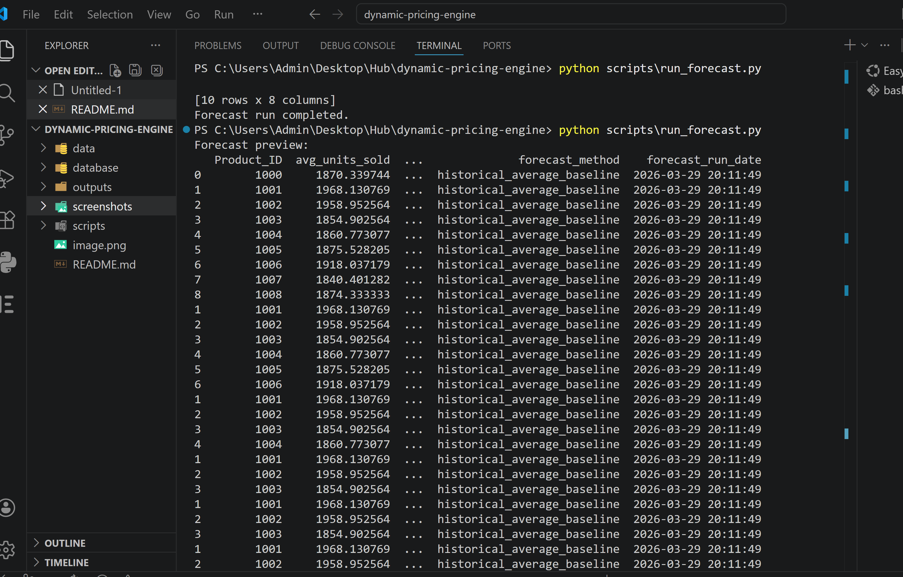
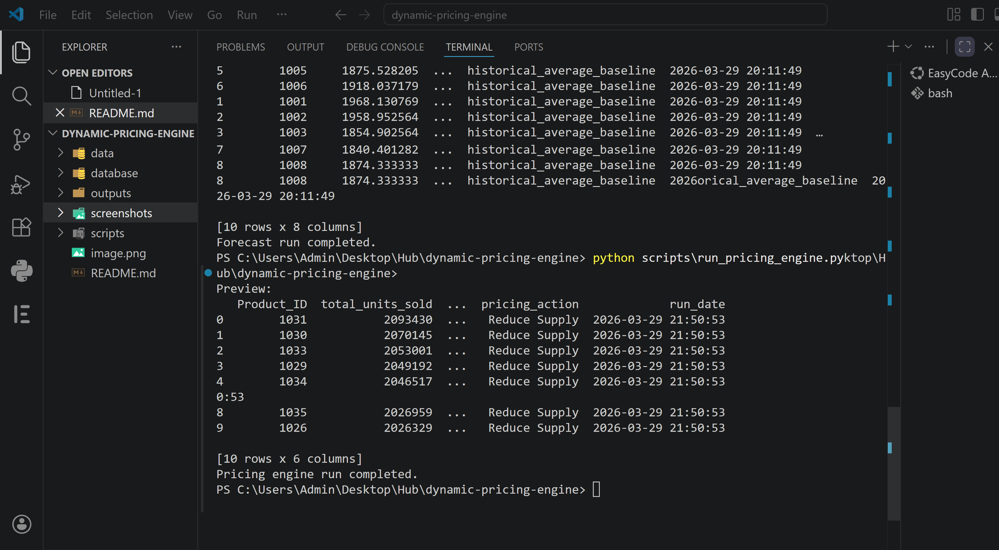

# Dynamic Pricing Engine

## Short Overview
Dynamic Pricing Engine is a practical decision‑support tool for retail businesses. It analyses historical sales and wastage patterns to recommend pricing or supply actions (increase price, discount price, reduce supply or keep stable) for each product. Outputs are pushed to an Airtable dashboard for operational use.

## Business Problem
Retailers often lose margin and create avoidable waste because pricing and supply decisions are too static. When demand changes but pricing or replenishment does not, the result can be over‑stocking, under‑pricing or poor stock allocation.

## Solution / Project Purpose
This project builds a simple engine that uses transaction‑level retail data to forecast demand and convert demand and wastage patterns into actionable recommendations. The aim is to move teams from reviewing raw numbers to acting on a short list of recommended pricing or supply changes.

## Key Features
- **Data‑driven demand estimation:** estimates future demand using historical sales data.
- **Decision rules:** combines demand levels and wastage behaviour to assign actions such as increase price, discount, reduce supply or keep stable.
- **Recommendation table:** produces a concise table of product‑level recommendations.
- **Airtable integration:** pushes the output to Airtable so non‑technical users can review and act on the insights.
- **Command‑line scripts:** includes scripts to run the forecast and pricing engine from a terminal.

## Tools and Technologies
- **Python:** Pandas and SQLite for data processing.
- **SQLite:** stores aggregated sales and wastage data at product level.
- **Airtable API:** publishes recommendation tables to Airtable for easy visibility.
- **Jupyter Notebook:** exploratory analysis and development environment.

## Workflow / Method
1. **Data preparation:** load raw retail sales data into SQLite and aggregate sales and wastage at the product level.
2. **Demand estimation:** use a simple historical average to generate a forecast signal for each product.
3. **Decision rules:** apply logic based on demand and wastage patterns to recommend pricing or supply actions.
4. **Output generation:** create a recommendation table and push the results to Airtable for operational use.

## Key Insights or Outcomes
- The engine translates raw demand and wastage data into product‑level recommendations, enabling teams to act quickly.
- Products with strong demand but high wastage were identified as supply‑planning problems rather than pricing wins; the action is to reduce supply or improve stock planning.
- Products with weak demand and high waste were flagged for markdowns to recover value.

## Business or Practical Impact
By converting historical patterns into actionable recommendations, this engine helps retailers improve pricing discipline, optimise stock levels and reduce avoidable waste. It provides a more operationally useful analytics workflow than traditional reporting.

## Visual Outputs

### Forecast Script Output
<p align="center">
  
</p>

### Pricing Engine Script Output
<p align="center">
  
</p>

### Airtable Dashboard View
<p align="center">
  
</p>

## Project Structure
```
.
├── data/                             # Raw input data
├── database/                         # SQLite database files
├── outputs/                          # Forecast and recommendation tables
├── scripts/                          # Python scripts to run forecast and pricing engine
├── screenshots/                      # Additional screenshots
├── airtable_dashboard.png            # Airtable dashboard preview
├── forecast.png                      # Forecast script output screenshot
├── pricing_engine.png                # Pricing engine script output screenshot
└── README.md
```

## How to Run or View

Clone the repository and run the command‑line scripts.

```bash
# run the demand forecast
python scripts/run_forecast.py

# generate pricing and supply recommendations
python scripts/run_pricing_engine.py
```

The recommendation table will be generated in the `outputs/` directory and published to Airtable if the API credentials are configured.

## Future Improvements
- Extend demand estimation with more advanced time‑series models.
- Integrate real‑time data feeds.
- Enhance decision rules to account for profitability, elasticity and inventory costs.
