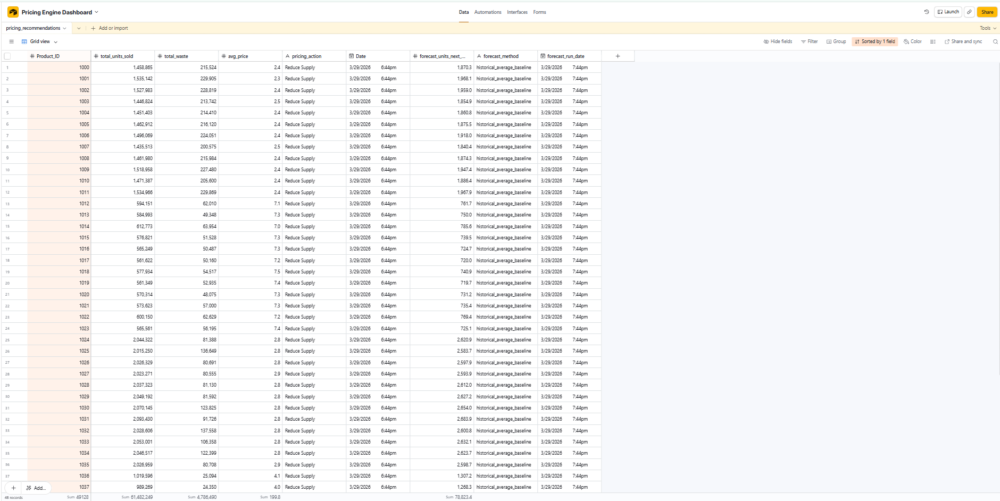

# 📊 Dynamic Pricing & Demand Forecasting Engine

## 🚀 Overview

This project simulates a real-world retail pricing system that uses historical sales data to:

- Forecast product demand  
- Detect inefficiencies (e.g. high wastage)  
- Recommend pricing or supply adjustments  

The goal is to demonstrate how data analysis can directly support **business decision-making in retail operations**.

---

## 💡 Business Problem

Retail businesses often struggle with:

- Overstocking → leads to waste  
- Underpricing → reduces profit margins  
- Poor demand planning → lost revenue  

This project solves that by using historical transaction data to generate **data-driven pricing recommendations**.

---

## ⚙️ What This Project Does

### 1️⃣ Demand Forecasting
- Uses historical averages to estimate next-period demand  
- Helps anticipate product performance  

### 2️⃣ Pricing Recommendation Engine

Based on demand & wastage:

- 📈 High demand + low waste → **Increase Price**  
- 📉 High demand + high waste → **Reduce Supply**  
- ⚠️ Low demand + high waste → **Discount Price**  
- ✅ Otherwise → **Keep Stable**  

---

## 📊 Example Output

| Product_ID | Avg Demand | Forecast | Action |
|----------|-----------|----------|--------|
| 1001     | 1968      | 1968     | Reduce Supply |
| 1005     | 1875      | 1875     | Reduce Supply |

---

## 📊 Dashboard Preview

This Airtable dashboard shows the final output including pricing decisions and forecasted demand:



---

## 🔄 Workflow

1. Raw transaction data → stored in SQLite  
2. Aggregation → calculate demand & wastage  
3. Forecast → estimate future demand  
4. Decision logic → generate pricing action  
5. Output → pushed to Airtable dashboard  

---

## 🧱 Project Structure

```
dynamic-pricing-engine/
│
├── data/
│   └── merged_dataset.csv
│
├── database/
│   └── pricing_system.db
│
├── scripts/
│   ├── run_pricing_engine.py
│   ├── run_forecast.py
│   └── run_pricing_to_airtable.py
│
├── outputs/
│   ├── pricing_recommendations.csv
│   └── forecast_output.csv
│
├── screenshots/
│   └── airtable_dashboard.png
│
├── README.md
```

---

## ▶️ How to Run

Run pricing engine:

```bash
python scripts/run_pricing_engine.py
```

Run demand forecast:

```bash
python scripts/run_forecast.py
```

Send results to Airtable dashboard:

```bash
python scripts/run_pricing_to_airtable.py
```

---

## 🛠 Tech Stack

- Python (data processing)  
- Pandas (analysis)  
- SQLite (data storage)  
- Airtable API (dashboard integration)  

---

## 👤 Author

**Seun Oseola**